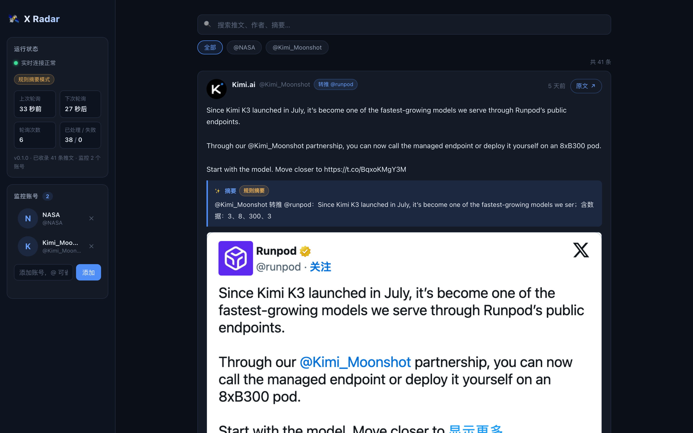
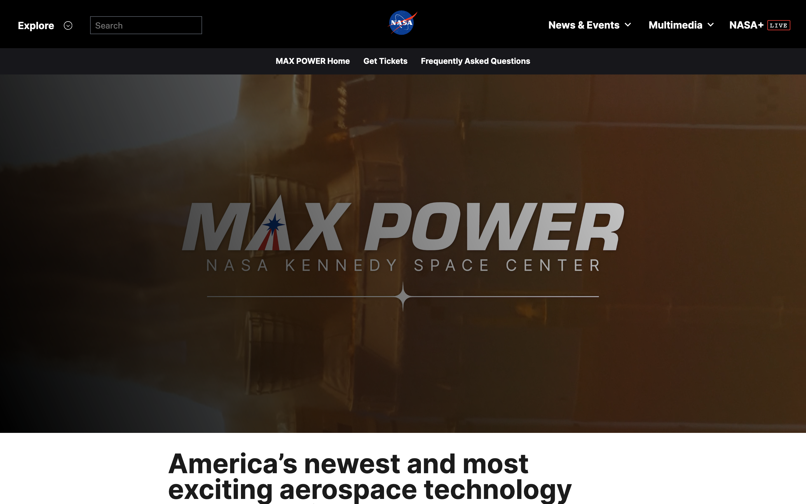

<div align="center">

# 🛰 X Radar

**监控 X（Twitter）博主推文：新推秒级同步 · 匿名截图 · AI 中文摘要 · 浏览器插件推送**

**无需 X API Key，不登录、不暴露你的账号信息**

[](https://www.python.org/)
[](https://fastapi.tiangolo.com/)
[](https://playwright.dev/python/)
[](https://github.com/JingHao-Leon/x-radar/actions/workflows/ci.yml)
[](LICENSE)

*监控台 · 匿名推文截图 · 外链网页截图 · AI 摘要 · SSE 实时流 · Chrome 插件*

</div>

---

X Radar 是一个自托管的 X（Twitter）博主推文监控台：你把想盯的博主加进监控列表，它按周期轮询官方 syndication 数据源（**不需要登录、不需要申请 X API**），一有新推文就立刻同步到 Web 仪表盘，自动对推文内容**匿名截图**、对推文里引用的外部网页**整页截图 + 正文抽取**，并生成**中文 AI 摘要**。配套一个 Chrome 插件：你刷 X 的时候它把监控博主的新推**实时推给服务端**（比轮询更快），有新内容时弹系统通知。

> 核心隐私设计：所有截图都在**匿名浏览器上下文**中完成——每次任务新建无 Cookie 的浏览器上下文，推文截图走 X 官方 embed 渲染页，画面里只有推文本身，**从机制上拍不到你的账号信息**（有自动化测试断言请求头零 Cookie，见 [测试与回测](#-测试与回测)）。

| 监控台 | 推文匿名截图 | 引用网页截图 |
|---|---|---|
|  |  |  |

## ✨ 功能特性

- **多博主监控**：添加任意公开账号（@handle），轮询周期可配（默认 60s）
- **新推秒级同步**：后端轮询 + SSE 实时推送仪表盘；开着 X 时插件通过 MutationObserver 直接抓到新推并回传，比轮询还快
- **匿名推文截图**：X 官方 embed 页渲染，2x 高清，只含推文内容（文本/图片/视频封面/互动数）
- **引用网页截图 + 正文抽取**：推文里的外链自动跟随短链、截取首屏、抽出正文与 meta 描述
- **AI 中文摘要**：任何 OpenAI 兼容接口皆可（Kimi / DeepSeek / OpenAI…）；不配 Key 自动降级为内置规则摘要
- **Web 仪表盘**：搜索、按账号筛选、骨架屏、lightbox 大图、失败重试，纯原生实现零依赖
- **Chrome 插件**：x.com 上一键「加监控」，系统通知推送新推，角标未读数
- **一键回测**：`scripts/backtest.py` 用真实历史时间线回放「发现-去重-截图-摘要」全流程并出报告

## 🚀 30 秒跑起来

```bash
# 1. 安装（Python ≥3.10）
git clone https://github.com/JingHao-Leon/x-radar.git && cd x-radar
pip install -e .
python -m playwright install chromium-headless-shell

# 2. 启动（默认 http://127.0.0.1:8787）
python -m x_radar

# 3. 打开监控台，添加第一个博主
open http://127.0.0.1:8787
```

在仪表盘左栏输入框输入 handle（如 `NASA`）点「添加」，几十秒后第一张截图和摘要就会出现在信息流里。

启用 AI 摘要（可选，任何 OpenAI 兼容接口）：

```bash
export XR_LLM_BASE_URL=https://api.moonshot.cn/v1   # Kimi；或 https://api.deepseek.com/v1 等
export XR_LLM_API_KEY=sk-xxx
export XR_LLM_MODEL=kimi-k2-0905-preview
python -m x_radar
```

国内网络访问 X 需要代理时，`XR_PROXY=auto` 会自动读 `HTTPS_PROXY` 环境变量或系统代理（macOS）；也可显式指定 `XR_PROXY=http://127.0.0.1:7890`。

## 🧩 Chrome 插件

1. 打开 `chrome://extensions` → 右上角「开发者模式」→「加载已解压的扩展程序」→ 选择 `extension/` 目录
2. 点插件图标，填入服务端地址（默认 `http://127.0.0.1:8787`）和 Token（若设置了 `XR_TOKEN`），保存
3. 刷 x.com 时，监控博主的新推会被实时回传服务端；有新内容弹系统通知
4. 在任意博主主页点右下角「🛰 加监控」即可把该博主加入监控列表

权限说明：`storage`（存服务端地址）、`alarms`（轮询通知）、`notifications`（桌面通知）、`host_permissions`（访问你自建的服务端与 x.com）。

## 🔍 工作原理

```
┌─────────────┐   轮询(60s)   ┌──────────────────────────────┐
│ syndication │──────────────▶│  解析 __NEXT_DATA__ 时间线 JSON │
│  官方数据源  │               │  （无需登录 / 无 API Key）      │
└─────────────┘               └──────────────┬───────────────┘
┌─────────────┐   实时回传                   │ 新推文（去重入库）
│ Chrome 插件 │──────────────▶  ┌──────────▼──────────┐
│ (x.com 采集) │                │  处理队列 (asyncio)   │
└─────────────┘                └──────────┬──────────┘
                        ┌─────────────────┼─────────────────┐
                        ▼                 ▼                 ▼
                  匿名 embed 截图    外链页截图+正文抽取    AI/规则中文摘要
                        └─────────────────┼─────────────────┘
                                          ▼
                          SQLite 存储 + SSE 推送仪表盘/插件通知
```

**匿名截图的隐私保证**：每次截图任务新建浏览器上下文并显式清空 Cookie，推文渲染走 `platform.twitter.com/embed/Tweet.html`（X 官方嵌入页），页面只包含推文本身——即使你本机登录过 X，截图里也不会出现你的账号、时间线或任何个性化内容。`tests/test_shots_safety.py` 用本地回显服务断言截图请求头中**零 Cookie、零 Authorization**。

## 📊 测试与回测

```bash
# 单元 + API + 截图安全测试（23 项，CI 同款）
python -m pytest tests -q

# 回测：真实历史时间线回放「发现-去重-截图-摘要」全链路，输出报告
python scripts/backtest.py --handle NASA --limit 3
```

实测数据（2026-09-16，macOS Apple Silicon，代理网络，完整报告见 [docs/backtest-report.md](docs/backtest-report.md)）：

| 指标 | 结果 |
|---|---|
| @NASA 时间线回放检出 | **20/20（100%）**，重叠窗口重复检出 **0** 条 |
| 完整管线（最新 3 条） | 截图 3/3 成功，摘要 53~123 字/条，单条 24~47s |
| 匿名安全断言 | 截图请求头 Cookie/Authorization 出现次数 **0** |
| 实时增量 | 服务运行 3 个轮询周期内自动捕获 NASA 新推文并入队处理 |

## 🔌 配置参考

| 环境变量 | 默认 | 说明 |
|---|---|---|
| `XR_PORT` / `XR_HOST` | 8787 / 127.0.0.1 | 监听地址 |
| `XR_DATA_DIR` | ./data | SQLite 与截图存储位置 |
| `XR_POLL_INTERVAL` | 60 | 轮询周期（秒，下限 30）；触发 429 限流时自动叠加退避（5→10→20→30→60 分钟封顶），恢复后逐级回落 |
| `XR_PROXY` | auto | auto/off/显式地址；auto 读环境变量与系统代理 |
| `XR_TOKEN` | 空 | 设置后 API 与插件需带 `X-Radar-Token` 头 |
| `XR_LLM_BASE_URL` / `XR_LLM_API_KEY` / `XR_LLM_MODEL` | 空 | OpenAI 兼容摘要接口；留空用规则摘要 |
| `XR_CDP_ENDPOINT` | 空 | 接管本机已开调试端口的浏览器截图（如 Kimi WebBridge 管理的浏览器） |
| `XR_MAX_PAGES` | 3 | 每条推文最多抓取的外链页数 |

> 💡 **Kimi WebBridge 用户**：X Radar 的截图引擎默认自建无头浏览器；如果你在用 [Kimi WebBridge](https://zhuanlan.zhihu.com/p/2040151641190568991) 让 AI Agent 操控本机真实浏览器，可让 WebBridge 启动的浏览器带上 `--remote-debugging-port=9222`，再把 `XR_CDP_ENDPOINT=http://127.0.0.1:9222` 指过去，X Radar 会直接复用该浏览器实例截图（CDP 协议，Playwright 原生支持）。

完整 API 契约见 [docs/API.md](docs/API.md)（`/api/feed`、`/api/stream` SSE、`/api/ingest` 插件推送等）。

## ❓ FAQ

**Q: 需要申请 X API 或登录 X 吗？**
不需要。数据来自 X 官方 syndication 嵌入数据源，截图走匿名 embed 渲染页，全程无登录态。

**Q: 会被 X 限流吗？**
会。syndication 数据源按 IP 限频，高频轮询（如多账号 × 60s 挂机一整夜）会触发 429。X Radar 对此有自适应退避：一个账号收到 429 就全局暂停本轮（限流按 IP，其余账号必然同样受限），等待时间按 5→10→20→30→60 分钟逐级翻倍（尊重响应头 `Retry-After`），每经历一轮干净轮询回落一级直至完全恢复，全程在面板倒计时上可见。**长期挂机建议 `XR_POLL_INTERVAL≥300` 且监控账号控制在个位数。**

**Q: 能监控私密账号吗？**
不能。只能监控公开可见的账号——这正是"不暴露自己账号"的代价与边界。

**Q: "立马同步"有多快？**
后端轮询周期默认 60s（可调到 30s）；装了插件且你正开着 x.com 时，新推在页面渲染出的 2 秒内就会被回传，几乎实时。

**Q: 转推/引用推怎么处理？**
转推显示「转推 @原作者」徽章并抓取原推内容；引用推的 embed 截图天然包含被引用推文；引用的外部网页单独截图 + 摘要。

**Q: 摘要一定要配 LLM 吗？**
不配也能用（内置规则摘要：前几句 + 数字要点）；配上 Kimi/DeepSeek 等任何 OpenAI 兼容接口即可升级为 AI 摘要，LLM 失败自动降级不阻塞管线。

**Q: 合规吗？**
个人自用、低频轮询（默认 60s）、只缓存公开数据的截图与摘要，并始终附原文链接。请勿高频抓取或用于商业转发。

## ⚠️ 局限（Limitations）

- **依赖 syndication 数据源**：X 未承诺该嵌入接口的稳定性，结构变更可能导致解析失败（解析器已做容错，失败会体现在状态卡错误列表）；按 IP 限频，触发 429 时自动全局指数退避（5~60 分钟），过于频繁的轮询会显著拉长同步延迟
- **只能监控公开账号**，无法看到仅登录可见的内容，也无法保证时间线 100% 完整（数据源只返回最近约 20 条）
- **截图成功率受目标网页影响**：强反爬（Cloudflare 盾）、纯 SPA 长加载的页面可能截图失败或超时（单页上限 30s，失败不阻塞其余流程，可手动重试）
- **无多用户/认证体系**：定位为个人自托管工具，`XR_TOKEN` 只是共享口令而非用户系统
- **摘要质量依赖所配模型**：规则摘要是降级方案，不能替代 LLM 摘要
- **插件采集依赖 X 的前端 DOM 结构**（`data-testid` 选择器），X 改版可能需要更新选择器

## 🤝 贡献

Issue / PR 欢迎：解析器容错规则、新的数据源适配、插件选择器更新都是高价值贡献点。

## 📄 License

[MIT](LICENSE) © 2026 JingHao-Leon
